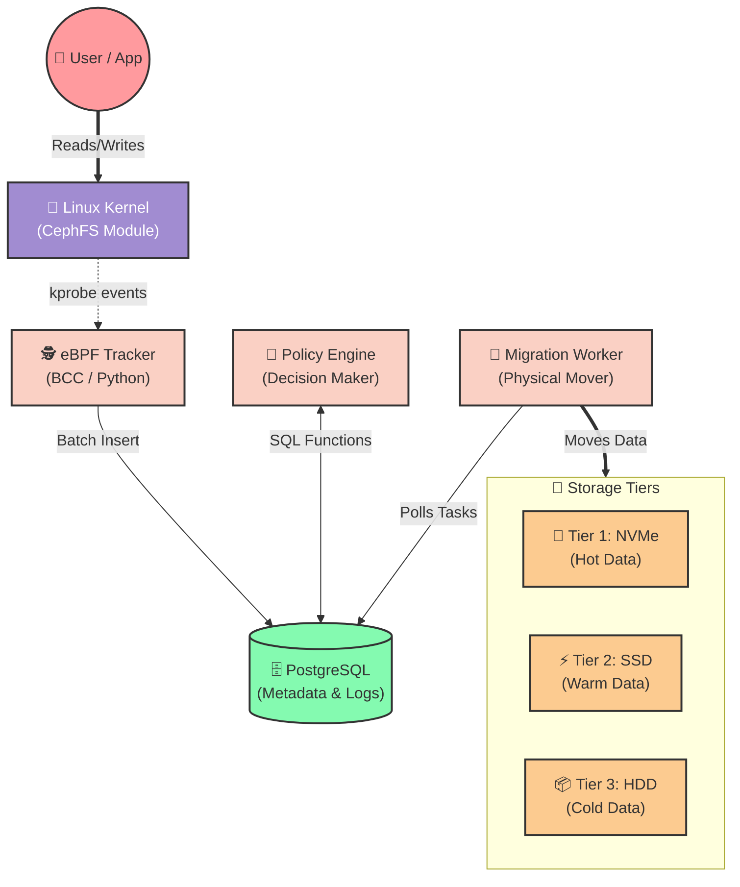
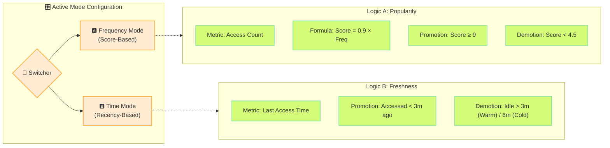
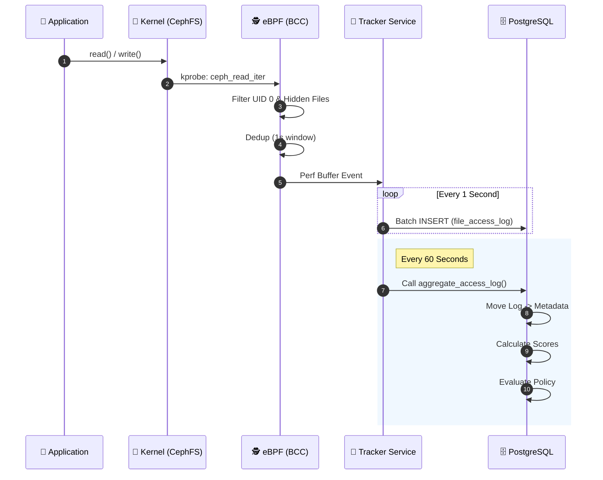
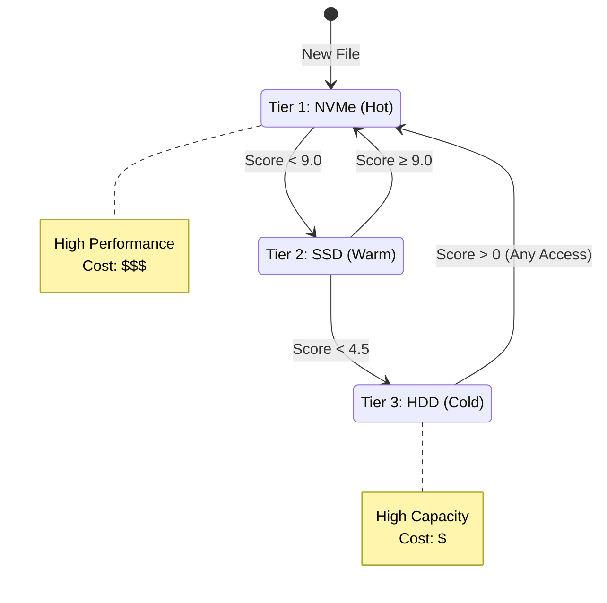
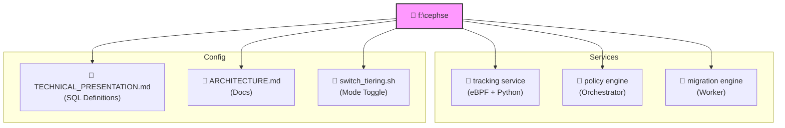

# 🌈 CephFS Storage Tiering System Architecture

> **A Dual-Mode, Automated Tiering Solution for High-Performance Storage**
> *Optimizing costs and performance using eBPF tracking and Intelligent Policy Engines.*

---

## 🏗️ System Overview

This system manages data placement across three storage tiers by analyzing file access patterns. It features a unique **Dual-Mode** capability, allowing administrators to switch between *Frequency-Based* and *Time-Based* optimization strategies on the fly.

### 🎨 High-Level Architecture

---

## 🧠 Dual-Mode Intelligence

The system's core differentiator is its ability to switch "brains" based on workload needs.

### 1. Frequency Mode (Score-Based)
*   **Philosophy**: "Keep heavily used files fast, even if they haven't been touched in a few minutes."
*   **Formula**: `Score = 0.90 * Access_Frequency`
*   **Use Case**: Databases, Shared Libraries, Hot Datasets.

### 2. Time Mode (Recency-Based)
*   **Philosophy**: "Keep recently touched files fast. Move everything else to cold storage quickly."
*   **Logic**: 3-minute and 6-minute idle thresholds.
*   **Use Case**: Log processing, Temporary workspaces, Backups.

---

## 🔄 Data Lifecycle & Flow

The journey of a file access event from the Kernel to the Database.

---

## 🛠️ Detailed Component Architecture

### 1. eBPF Tracker (`f:\cephse\tracking service`)
*   **Technology**: BCC (BPF Compiler Collection) hooks into `ceph_read_iter` and `ceph_write_iter`.
*   **Performance**: Uses BPF maps for in-kernel deduplication to minimize overhead.
*   **Output**: Stream of access events to PostgreSQL `file_access_log`.

### 2. Database Layer (`PostgreSQL`)
*   **Hot Table**: `file_access_log` - Append-only, high write throughput.
*   **Cold Table**: `file_metadata` - Stores the state, score, and tier of every file.
*   **Logic**: All tiering logic resides in **Stored Procedures** (`aggregate_access_log`, `apply_tiering_policies`). This ensures data locality and high performance.

### 3. Migration Worker (`f:\cephse\migration engine`)
*   **Parallelism**: 5 concurrent worker threads.
*   **Mechanism**: Server-side object copy (using `librados`/`libcephfs`). Data does not pass through the client.
*   **Safety**: Uses **Shadow Files** for atomic pool switching.
    1.  Create `file.txt.__tiering__` in target pool.
    2.  Copy data.
    3.  `mv file.txt.__tiering__ file.txt` (Atomic Rename).

### 4. Policy Engine (`f:\cephse\policy engine`)
*   **Role**: The conductor. It wakes up every 60s to trigger the DB functions.
*   **Switching**: Dynamically chooses which SQL function to call based on the mode set by `switch_tiering.sh`.

---

## 📊 Tiering Logic Visualization

How a file moves through the tiers in **Frequency Mode**.

---

## 📂 Project Structure Map

