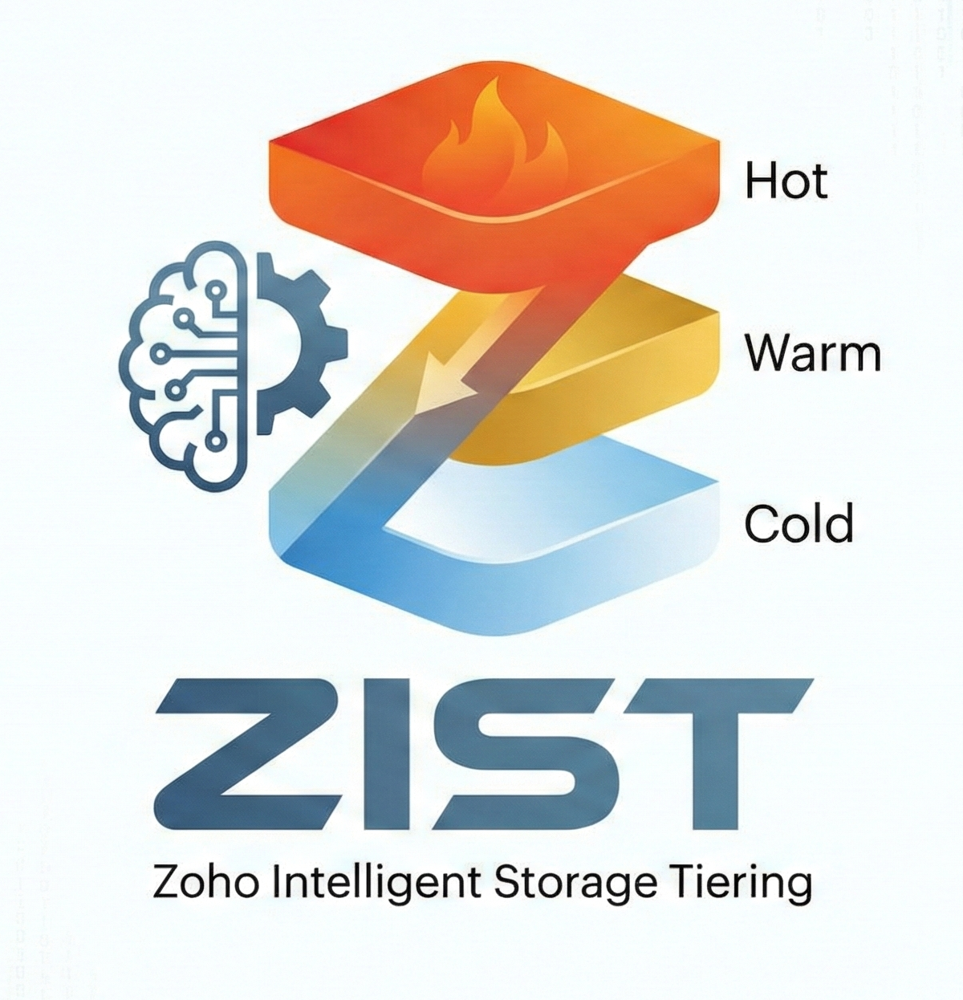
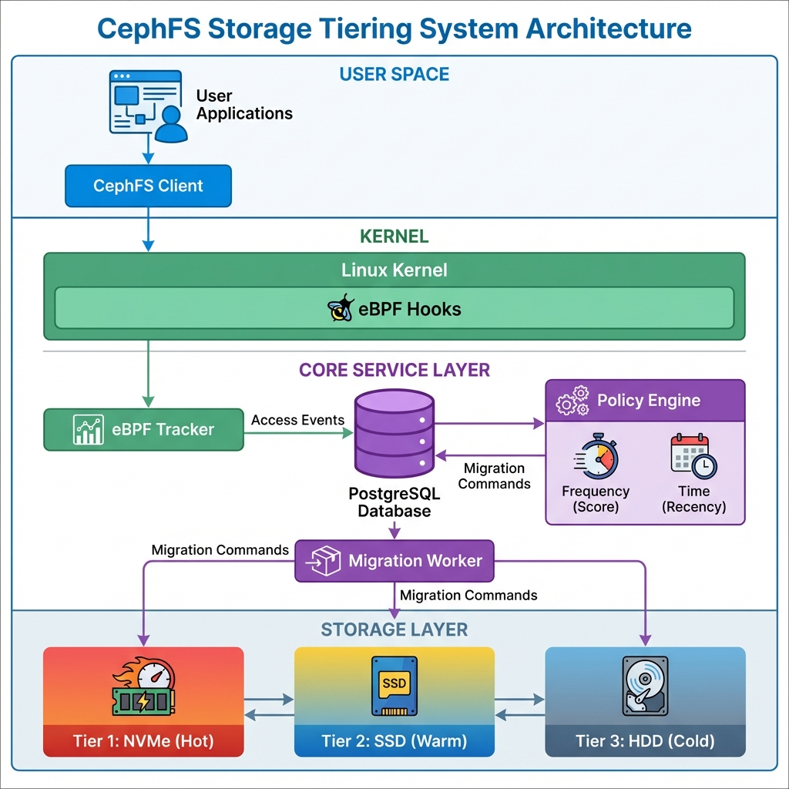

  # Storage Tiering in CephFS
<div align="center">
  
  
  
  **Automated storage tiering for CephFS with eBPF-based access tracking and intelligent pool migration**
  
  [](https://docs.ceph.com/en/latest/cephfs/)
  [](https://www.postgresql.org/)
  
</div>

---

## 📋 Table of Contents
- [Description](#-description)
- [Key Features](#-key-features)
- [Architecture](#-architecture)
- [Technology Stack](#-technology-stack)
- [Prerequisites](#-prerequisites)
- [Installation](#-installation)
- [Usage](#-usage)
- [Documentation](#-documentation)
- [System Comparison](#-system-comparison)
- [Mode Selection Guide](#-mode-selection-guide)
- [Development](#-development)
- [Architecture Decisions](#architecture-decisions)

---

## 🎯 Description

An enterprise-grade automated storage tiering system for CephFS that intelligently migrates files between **hot**, **warm**, and **cold** storage pools based on access patterns. The system operates using **eBPF kernel hooks** for minimal (2-5%)-overhead access tracking and **PostgreSQL** for analytics-driven policy decisions.

**Dual-Mode Operation**: Choose between frequency-based (hot data stays hot) or time-based (recent data stays hot) tiering policies that can be switched dynamically without data loss.

---

## ✨ Key Features

### **Dual-Mode Tiering**
- **Frequency-Based Mode**: Files tier based on access count (`score = 0.90 × access_freq`)
- **Time-Based Mode**: Files tier based on last access timestamp (3min → warm, 6min → cold)
- **Dynamic Switching**: Change modes without data loss.

### **File Operation Handling**
- ✅ **File Moved**: Path updated automatically (inode-based tracking)
- ✅ **File Copied**: Treated as separate entity (new inode = new file)
- ✅ **Symlink Created**: Target file's access count incremented
- ✅ **File Deleted**: Removed from tracking database automatically
- ✅ **Subdirectories**: Full path resolution via inode lookup

### **Performance Optimizations**
- ⚡ **Batch Processing**: 1000-event batches → 100x faster database writes
- ⚡ **Parallel Migration**: 5 concurrent workers with lock-free execution (`SKIP LOCKED`) (Horizontal scaling possible)
- ⚡ **Zero Data Loss**: Watermark-based aggregation prevents event loss during processing
- ⚡ **Hot/Cold Tables**: Append-only hot table + aggregated cold table architecture

### **Reliability Features**
- 🛡️ **Atomic Migrations**: Shadow file technique ensures no partial migrations
- 🛡️ **Inode Tracking**: Handles inode changes from cross-pool renames
- 🛡️ **Timestamp Preservation**: `last_access` maintained across migrations
- 🛡️ **Root User Filtering**: Skips tracking migration operations (UID 0)
- 🛡️ **Service Recovery**: Automatic restart on failure via systemd

### **Operational Features**
- 📊 **PostgreSQL Analytics**: SQL-based policy logic for flexibility
- 📊 **Real-time Monitoring**: Track file distribution across pools
- 📊 **Migration Statistics**: Log every migration with timing metrics
- 📊 **Test Mode**: 3 minutes = 30 days for rapid validation

---

## 🏗️ Architecture

<div align="center">
  
</div>

### Architecture Overview

The system uses a **4-layer pipeline** for efficient storage tiering:

```
eBPF (Kernel) → Access Tracker (Python) → Policy Engine (SQL) → Migration Worker (C + Python)
```

**Layer 1: eBPF Kernel Hooks**
- Hooks: `ceph_read_iter()`, `ceph_write_iter()`
- Captures: inode, UID, filename, timestamp
- Deduplication: 1-second in-kernel window
- Output: Perf buffer → userspace

**Layer 2: Access Tracker**
- Polls eBPF perf buffer
- Resolves full path: `find /tiercephfs -inum <inode>`
- Batch INSERT into `file_access_log` (hot table)
- Aggregates every 60s into `file_metadata` (cold table)

**Layer 3: Policy Engine**
- Runs PostgreSQL stored functions every 60s
- Mode 1: `apply_tiering_policies()` - frequency-based scoring
- Mode 2: `mark_files_for_migration()` - timestamp thresholds
- Marks files: `needs_migration = TRUE`, sets `target_pool`

**Layer 4: Migration Worker**
- 5 parallel workers with `SELECT ... FOR UPDATE SKIP LOCKED`
- Calls `libcephfs_migrate` (C binary)
- Shadow file technique: `file.txt.__tiering__` → atomic rename
- Tracks inode changes: `old_inode → new_inode`

### Detailed Architecture

For comprehensive architecture documentation including component diagrams, data flow, and design decisions, see:

**Visual Diagrams**:
- **[Block Diagram](Architecture/block%20diagram.png)** - High-level system overview
- **[Detailed Architecture](Architecture/detailed.png)** - Component interactions and data flow
- **[Flowchart](Architecture/flowchart.png)** - Process flow and decision logic

---

## 🔧 Technology Stack

| Component | Technology | Purpose |
|-----------|-----------|---------|
| **Access Tracking** | eBPF + BCC (Python) | Kernel-level file access monitoring |
| **Database** | PostgreSQL 13+ | Hot/cold table architecture for analytics |
| **Migration** | libcephfs (C library) | Physical file pool migration |
| **Policy Engine** | Python 3 + PL/pgSQL | Tiering decision logic |
| **Orchestration** | systemd services | Service management and auto-restart |
| **File System** | CephFS (client-side) | Distributed storage with pool support |

### Services and Overhead

| Service | CPU Usage | Memory | Network | Disk I/O |
|---------|-----------|--------|---------|----------|
| **cephfs-tracker** | 5-10% (1 core) | 512 MB | Minimal | None |
| **cephfs-policy-engine** | <1% (periodic) | 50 MB | None | None |
| **cephfs-migration-worker** | 10-20% (during migration) | 200 MB | High (data transfer) | High (reads + writes) |
| **PostgreSQL** | 2-5% | 1-2 GB | Minimal | Low (batch writes) |

**Total System Overhead**:
- **Idle**: ~5-10% CPU, ~1 GB RAM
- **Active Migration**: ~30% CPU, ~2 GB RAM, high network/disk

---

## 📦 Prerequisites

### System Requirements
- **OS**: Linux (Ubuntu 20.04+)
- **Kernel**: 5.x+ (for eBPF support)
- **CephFS**: Client installed and mounted
- **RAM**: 4 GB minimum, 8 GB recommended
- **Storage**: 10 GB free for database and binaries

### Software Dependencies
```bash
# Ubuntu/Debian
sudo apt install -y \
  postgresql postgresql-client \
  python3 python3-pip \
  bpfcc-tools python3-bpfcc \
  libcephfs-dev ceph-common \
  build-essential clang
```

### Python Packages
```bash
sudo apt install -y python3-psycopg2
```

### CephFS Pools
Ensure three storage pools exist:
```bash
ceph osd pool create cephfs.tiercephfs.data  # SSD pool
ceph osd pool create cephfs.tiercephfs.warm  # Hybrid pool
ceph osd pool create cephfs.tiercephfs.cold  # HDD pool
```

---

## 🚀 Installation

### 1. Clone Repository
```bash
git clone https://github.com/sushrut-bhokre/Storage-Tiering.git
cd Storage-Tiering
```

### 2. Database Setup
```bash
# Run automated setup script
sudo bash scripts/setup_database.sh --db-pass 'your_password'

# Verify installation
sudo -u postgres psql tiering -c "SELECT COUNT(*) as tables FROM pg_tables WHERE schemaname='public';"
sudo -u postgres psql tiering -c "SELECT COUNT(*) as functions FROM pg_proc JOIN pg_namespace ON pg_proc.pronamespace = pg_namespace.oid WHERE pg_namespace.nspname = 'public';"
# Expected: 2 tables, 13 functions
```

### 3. Compile Migration Binary
```bash
cd migration engine/
gcc -o libcephfs_migrate libcephfs_migrate.c -lcephfs
sudo cp libcephfs_migrate /usr/local/bin/
sudo chmod +x /usr/local/bin/libcephfs_migrate
```

### 4. Install Services
```bash
# Copy service files
sudo cp tracking\ service/cephfs-tracker.service /etc/systemd/system/
sudo cp policy\ engine/cephfs-policy-engine.service /etc/systemd/system/
sudo cp migration\ engine/cephfs-migration-worker.service /etc/systemd/system/

# Update paths in service files (adjust to your installation directory)
sudo nano /etc/systemd/system/cephfs-tracker.service
# Edit: ExecStart=/usr/bin/python3 /path/to/tracker_phase1.py
sudo nano /etc/systemd/system/cephfs-policy-engine.service
# Edit: ExecStart=/usr/bin/python3 /path/to/policy_engine.py
sudo nano /etc/systemd/system/cephfs-migration-worker.service
# Edit: ExecStart=/usr/local/bin/libcephfs_migrate /path/to/migration_worker.py
```

# Reload and enable
sudo systemctl daemon-reload
sudo systemctl enable cephfs-tracker cephfs-policy-engine cephfs-migration-worker
```

### 5. Deploy Mode Switcher (Optional)
```bash
sudo cp switch_tiering.sh /usr/local/bin/switch_tiering
sudo chmod +x /usr/local/bin/switch_tiering
```

### 6. Start Services
```bash
sudo systemctl start cephfs-tracker
sudo systemctl start cephfs-policy-engine
sudo systemctl start cephfs-migration-worker
```

### 7. Verify Installation
```bash
# Check service status
sudo systemctl status cephfs-tracker
sudo systemctl status cephfs-policy-engine
sudo systemctl status cephfs-migration-worker

# Check database
sudo -u postgres psql tiering -c "SELECT COUNT(*) FROM file_metadata;"

# Check eBPF program
sudo bpftool prog list | grep ceph
```

---

## 📘 Usage

### Switch Tiering Modes
```bash
switch_tiering frequency  # Enable frequency-based mode
switch_tiering time       # Enable time-based mode
switch_tiering status     # Check current mode
switch_tiering off        # Disable tiering (stop policy engine)
```

### Monitor System
```bash
# View file distribution
sudo -u postgres psql tiering -c "
SELECT SUBSTRING(current_pool, 20) AS pool, COUNT(*) 
FROM file_metadata 
GROUP BY current_pool;"

# View migration queue
sudo -u postgres psql tiering -c "
SELECT COUNT(*), target_pool 
FROM file_metadata 
WHERE needs_migration = TRUE 
GROUP BY target_pool;"

# Watch real-time logs
sudo journalctl -u cephfs-tracker -f
sudo journalctl -u cephfs-policy-engine -f
sudo journalctl -u cephfs-migration-worker -f
```

### Manual Operations
```bash
# Trigger aggregation manually
sudo -u postgres psql tiering -c "SELECT aggregate_access_log();"

# Run policy evaluation manually
sudo -u postgres psql tiering -c "SELECT * FROM apply_tiering_policies();"

# Migrate specific file
libcephfs_migrate /tiercephfs/file.txt cephfs.tiercephfs.cold
```

---

## 📚 Documentation

| Document | Description |
|----------|-------------|
| [ARCHITECTURE.md](ARCHITECTURE.md) | Complete system architecture and component details |
| [TECHNICAL_PRESENTATION.md](TECHNICAL_PRESENTATION.md) | Technical deep dive with algorithms and SQL functions |
| [QUICK_REFERENCE.md](QUICK_REFERENCE.md) | Command reference and troubleshooting |

---

## 🔄 System Comparison

### 1. Comparison with Industry Storage Tiering Solutions

| Feature | **This System (CephFS)** | **AWS S3 Intelligent-Tiering** | **Oracle ILM** | **Meta F4/BLOB** |
|---------|-------------------------|-------------------------------|----------------|------------------|
| **Tiering Algorithm** | **Dual-mode**: Frequency-based (`score = 0.90 × access_freq`) OR Time-based (last access) | Last access time only | Minimum retention period + policies | Age + access rate (predictive) |
| **Decision Criteria** | Real-time access patterns + timestamp | Object metadata (last access) | Time-based rules + tablespace policies | ML-based prediction + access frequency |
| **Storage Tiers** | 3 tiers: Hot (SSD), Warm (Hybrid), Cold (HDD) | 4 tiers: Frequent, Infrequent, Archive, Deep Archive | Unlimited (user-defined tablespaces) | 3 tiers: Hot (f4), Warm (BLOB), Cold (Glacier-like) |
| **File System** | CephFS (POSIX, distributed) | S3 (object storage) | Oracle ASM / tablespaces | Tao/Haystack (proprietary) |
| **Access Tracking** | eBPF kernel hooks (real-time, per-file) | S3 access logs (periodic, object-level) | Database statistics | Custom monitoring layer |
| **Migration Speed** | 5+ parallel workers, immediate | Automatic, background (24-48h delay) | Scheduled or manual | Batch processing (hourly/daily) |
| **Flexibility** | Switchable modes without data loss | Fixed algorithm | Policy-driven (SQL-based) | Hard-coded with ML tuning |
| **Granularity** | Per-file (inode-based) | Per-object | Per-row/partition | Per-blob (chunk-level) |
| **Deployment** | Client-side (no cluster changes) | Cloud service (managed) | Database-integrated | Datacenter infrastructure |
| **Cost Model** | Storage hardware cost | Pay per tier + transitions | Oracle licensing + storage | Internal (cost of downgrade) |
| **Use Case** | shared filesystems,Independent file systems | Cloud object storage, backups | Transactional databases, archives | Social media photos/videos |
| **Transparency** | Fully transparent (files stay accessible) | API-based (requires application changes) | Transparent within Oracle | Transparent within Meta apps |
| **Open Source** | Yes (can be deployed anywhere) | No (AWS proprietary) | No (Oracle proprietary) | No (Meta internal) |

**Key Differentiators**:
- ✅ **Dual-mode flexibility**: Only system that supports both frequency and time-based policies
- ✅ **Real-time tracking**: eBPF provides instant access pattern visibility
- ✅ **Open-source**: Can be deployed in any environment with CephFS
- ✅ **POSIX compatibility**: Works with standard filesystem operations
- ⚠️ **Manual setup**: Requires infrastructure setup (AWS is fully managed)
- ⚠️ **CephFS dependency**: Requires CephFS cluster (AWS works with any object)

---

### 2. Technology Stack Comparison

#### Access Tracking Technologies

| Technology | **This System** | **AWS CloudWatch** | **Oracle AWR** | **Meta Monitoring** |
|------------|-----------------|--------------------|--------------------|---------------------|
| **Method** | eBPF kernel hooks | S3 server-side logs | Database statistics collector | Custom kernel modules |
| **Overhead** | 2-5% CPU | Minimal (log collection) | 1-3% DB overhead | <1% (highly optimized) |
| **Latency** | Real-time (<1ms) | Minutes to hours | 5-15 minutes (snapshot interval) | Near real-time |
| **Granularity** | Per-file, per-access | Per-object request | Per-SQL statement | Per-blob operation |
| **Scalability** | 10K events/sec per client | Unlimited (cloud-scale) | Database-limited | Petabyte-scale |


**When to Use Alternatives**:
- **RocksDB**: If write throughput exceeds 50K events/sec (use as hot-path cache)
- **Cassandra**: If scaling to 100+ nodes with multi-datacenter replication


## 🎯 Mode Selection Guide

### Use **Frequency-Based Mode** when:
- Files have varying importance based on usage patterns
- Popular files should stay fast regardless of age
- Workload: Machine learning datasets, shared libraries, build caches
- Example: Frequently accessed old config files stay hot

### Use **Time-Based Mode** when:
- Recent data is more valuable than old data
- Files naturally age out of relevance
- Workload: Log files, time-series data, backups
- Example: Today's logs stay hot, last week's logs go cold

---


## 👥 Dvelopement

- Document version: 1.0.0
- Release Date : Jan 2026


---


## Architecture Decisions

### Why Find for Path Resolution?
- **eBPF verifier constraints**: Complex dentry walking rejected
- **Reliability**: find guaranteed to return correct path
- **Performance acceptable**: Cached by filesystem, <50ms
- **Simplicity**: No complex kernel struct navigation

### Why Shadow File Migration?
- **Atomic operation**: Rename is atomic, no partial migration
- **Data integrity**: Original file untouched until rename
- **Pool change**: CephFS creates new inode on cross-pool rename
- **No downtime**: File briefly at old path + new path, then switched